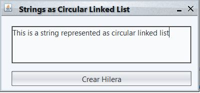
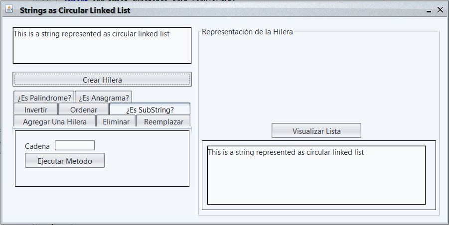

# Strings represented as Circular Linked List

This repository contains a Java desktop application, which is a set of algorithms used to handle strings represented as circular linked lists. 

The project accepts any string as input and then build a circular linked list that represents it.

Each alphanumeric character in the string is represented by a node in the list. This project has not in account the special characters.

For this project, you can try the following tasks:

* Add or insert a string.
* Delete the string: partially or completely.
* Modify string (REPLACE operation).
* Reverse the string.
* Sort the row alphabetically.
* Determine if the original string is substring from another string.
* Determine if the string is a palindrome or not.
* Determine if the string is an anagram of another.

### Application Screens
* **Index**


* **Main**


### Environment

This project is developed in Java 8 environment. If you want to execute the project you must have Java JDK 1.8.1 and ```substance-4.3.jar```. 


_Feel free to make my comments, corrections or advice_